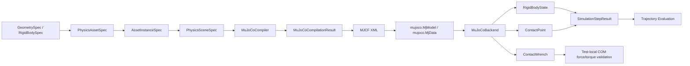

# Physical Simulation Phase 1–2D3A.5 技术总结

本文档总结 `physical_simulation` 项目从 Phase 1 到 Phase 2D3A.5 已经完成的真实能力、数学约定、测试证据和当前限制。内容基于当前仓库中的源码、测试、示例程序、`README.md`、`docs/architecture.md` 与 `pyproject.toml` 核对后编写，而不是仅根据提交信息或路线图拼接。

当前最新状态：

```text
original summary baseline: 5194c51 Validate multidirectional contact wrenches
supplement: compound inertia full tensor module
supplement: expanded parametric GeometrySpec module
supplement: MuJoCo convex mesh fallback for selected parametric geometry
supplement: full tensor inertia for wedge, frustum, and regular prism
test result: 240 passed
```

本文档围绕以下主线组织：

```text
Physics IR
-> Scene IR
-> Transform
-> MJCF Compiler
-> MuJoCo Runtime
-> Body State
-> ContactPoint
-> ContactWrench
-> Trajectory Evaluation
-> Multi-directional Validation
```

## 1. 项目背景与目标

`physical_simulation` 是一个独立 Python 子项目，用于承接上游 3D reconstruction 或生成式 3D 资产之后的物理语义建模与仿真验证。它在完整 AIGC 流程中的位置可以概括为：

```text
图像或生成式模型
-> 3D 几何资产
-> 参数化物理资产
-> 物理场景
-> MuJoCo 仿真
-> 机器人交互与任务评估
```

当前项目已经解决或部分解决的问题包括：

- 后端无关的 Physics IR；
- 参数化刚体、碰撞体、visual/collider 分离；
- 质量、重心和惯量的显式定义；
- 场景中的 asset 多实例化；
- Transform 与四元数位姿组合；
- `PhysicsSceneSpec` 到 MJCF 的确定性编译；
- MuJoCo 模型加载、reset、step 与刚体状态读取；
- MuJoCo active contacts 到后端无关 `ContactPoint` 的映射；
- 单个 contact index 的 `mj_contactForce` 读取和世界坐标 `ContactWrench`；
- box、sphere、compound surface 的下落与静置稳定性验证；
- V 形槽多方向接触力与偏心碰撞转动响应验证。

当前尚未进入的范围包括：

- GLB 到 `PhysicsAssetSpec` 的自动连接；
- mesh collider；
- joint / articulation / actuator；
- robot model、controller、gripper；
- task framework 与 task success metrics；
- public per-body / body-pair contact wrench aggregation；
- contact impulse API；
- initial velocity / set velocity / external force API；
- GUI。

## 2. 总体架构

当前代码路径可以概括为：



模块职责如下：

| 模块 | 核心职责 | 是否依赖 MuJoCo |
| --- | --- | --- |
| `assets` | 参数化几何、刚体、visual、collider、材料、质量属性和 asset 构建器 | 否 |
| `scene` | asset 实例化、场景重力、timestep、metadata | 否 |
| `math` | 四元数归一化、Hamilton product、向量旋转、pose composition | 否 |
| `dynamics` | 几何体积、质量和对角惯量计算 | 否 |
| `compilers` | `PhysicsSceneSpec` 到 MJCF XML 的编译和 name mapping | 不导入 MuJoCo |
| `backends` | MuJoCo 模型加载、运行、状态读取、contact/wrench 读取 | `MuJoCoBackend` 依赖 |
| `runtime` | 后端无关运行时快照数据结构 | 否 |
| `evaluation` | 轨迹采样和 resting-contact 指标解释 | 否 |
| `tests/helpers` | 测试局部 contact wrench 聚合、V 槽与偏心撞击场景 | 测试中依赖 |

项目的重要设计原则是：Physics IR 和 runtime 数据结构不保存 MuJoCo numeric ID；具体物理后端只通过 compiler/backend 层接入。

## 3. 坐标系、单位与数学约定

当前项目使用三维右手坐标系，测试和示例均按 `+Z` 向上、重力 `(0, 0, -9.81)` 组织。主要单位约定为：

| 物理量 | 单位 |
| --- | --- |
| 位置、几何尺寸 | m |
| 质量 | kg |
| 时间 | s |
| 线速度 | m/s |
| 角速度 | rad/s |
| 力 | N |
| 力矩 | N·m |
| 四元数 | `(w, x, y, z)` |

runtime body ID 规则为：

```text
runtime_body_id = "{instance_id}/{body_id}"
```

这一区分很重要：

- `asset_id` 表示可复用资产；
- `body_id` 表示 asset 内部刚体；
- `instance_id` 表示场景中的一次实例化；
- `runtime_body_id` 唯一表示场景中的一个刚体；
- MuJoCo numeric body ID 和 geom ID 只在 `MuJoCoBackend` 内部存在。

## 4. Phase 1：参数化物理资产

### 4.1 GeometrySpec 与 primitive 语义

当前支持的 analytic primitive 包括：

- `BoxGeometry(size)`：`size=(x,y,z)` 表示完整长宽高；
- `SphereGeometry(radius)`：球半径；
- `CylinderGeometry(radius, height)`：沿局部 Z 轴的圆柱，`height` 为完整高度；
- `CapsuleGeometry(radius, length)`：沿局部 Z 轴的胶囊，`length` 是中间圆柱段的完整长度，不包含两端半球半径。
- `WedgeGeometry(size)`：右三角棱柱 / ramp，`size=(x,y,z)` 表示外接长方体完整尺寸；
- `ConeGeometry(radius, height)`：沿局部 Z 轴的实体圆锥；
- `FrustumGeometry(bottom_radius, top_radius, height)`：沿局部 Z 轴的实体圆台；
- `EllipsoidGeometry(radii)`：沿局部 X/Y/Z 轴的实体椭球；
- `SphericalCapGeometry(radius, height)`：球半径为 `radius`、球冠高度为 `height` 的实体球冠；
- `RegularPrismGeometry(sides, radius, height)`：正多边形棱柱，`radius` 是底面外接圆半径。

所有几何对象都有 `volume()`，并可序列化为 `dict`。这些 geometry 表示最终物理尺寸，而不是“基础尺寸再乘 transform scale”。这也是后续 mass/inertia 不读取 `Transform.scale` 的基础。

新增的 wedge/ramp、cone、frustum、ellipsoid、spherical cap 和 regular prism 首先是 Physics IR 语义对象。当前 MuJoCo compiler 直接支持 box、sphere、cylinder 和 capsule；wedge/ramp、cone、frustum 和 regular prism 会通过 deterministic convex mesh fallback 编译为 MJCF mesh。ellipsoid 和 spherical cap 仍会明确抛出 unsupported feature，后续需要曲面采样 mesh fallback 或后端专用表达。

### 4.2 visual 与 collider 分离

`RigidBodySpec` 同时包含：

- `visuals: tuple[VisualSpec, ...]`
- `colliders: tuple[ColliderSpec, ...]`

visual geometry 只用于显示，不参与碰撞映射，不参与 MuJoCo contact mapping，也不会作为质量来源。collision geom 才进入 collision group/mask、contact mapping 和 contact wrench 读取流程。一个刚体可以包含多个 collider，compound table 测试中一个 `table_body` 包含 5 个 collider。

### 4.3 质量与惯量

`MassProperties` 由 `mass`、`center_of_mass`、`inertia_diagonal` 构成。对 dynamic body，构建器可以通过显式 `mass` 或 `density` / `material.density` 生成质量和惯量；但 `mass` 与 `density` 互斥。

Box 惯量，设完整尺寸为 $(a,b,c)$、质量为 $m$：

$$
I_x=\frac{m}{12}(b^2+c^2)
$$

$$
I_y=\frac{m}{12}(a^2+c^2)
$$

$$
I_z=\frac{m}{12}(a^2+b^2)
$$

Sphere 惯量，半径为 $r$：

$$
I_x=I_y=I_z=\frac{2}{5}mr^2
$$

Cylinder 沿局部 Z 轴，半径 $r$、完整高度 $h$：

$$
I_x=I_y=\frac{m}{12}(3r^2+h^2)
$$

$$
I_z=\frac{1}{2}mr^2
$$

Capsule 惯量当前是工程近似，不是完整闭式半球积分张量。代码将 capsule 分解为：

```text
中间圆柱
+
两个半球组成的球体质量贡献
```

当前实现：

- cylinder volume：$\pi r^2 L$；
- sphere volume：$\frac{4}{3}\pi r^3$；
- 按体积分配 cylinder mass 和 sphere mass；
- 使用 solid sphere 近似两端半球的局部惯量；
- 对 transverse inertia 使用平行轴定理；
- 半球质心偏移使用：

$$
d=\frac{L}{2}+\frac{3r}{8}
$$

其中 $L$ 是 capsule 中间圆柱段长度。代码中 transverse 部分为：

$$
I_{\mathrm{transverse}}
=I_{\mathrm{cylinder},x}
+I_{\mathrm{sphere,axial}}
+m_{\mathrm{sphere}}d^2
$$

这是一种清晰、可测试的 Phase 1 近似；后续如果要做高精度 capsule inertia，应替换为严格积分或可信参考公式。

### 4.5 组合体完整惯量张量

后续补充的 `dynamics.compound_inertia` 模块开始支持复杂组合体质量属性计算。它不再只返回
`(I_x, I_y, I_z)`，而是先在 body-local frame 中构造完整对称惯量张量：

$$
\mathbf I =
\begin{bmatrix}
I_{xx} & I_{xy} & I_{xz}\\
I_{xy} & I_{yy} & I_{yz}\\
I_{xz} & I_{yz} & I_{zz}
\end{bmatrix}
$$

对每个子组件，当前流程为：

```text
primitive geometry + mass + local Transform
-> primitive local diagonal inertia
-> rotate tensor into compound body frame
-> shift tensor to compound COM with parallel-axis theorem
-> sum full tensors
-> symmetric eigen decomposition
-> principal inertia + principal axes
```

整体质心：

$$
\mathbf C=\frac{\sum_i m_i \mathbf c_i}{\sum_i m_i}
$$

子组件局部惯量旋转到组合体坐标系：

$$
\mathbf I_i^{body}=\mathbf R_i \mathbf I_i^{local}\mathbf R_i^T
$$

平行轴定理：

$$
\mathbf I_i^{C}
=
\mathbf I_i^{body}
+
m_i \left((\mathbf d_i^T\mathbf d_i)\mathbf E-\mathbf d_i\mathbf d_i^T\right)
$$

其中：

$$
\mathbf d_i=\mathbf c_i-\mathbf C
$$

总惯量张量：

$$
\mathbf I=\sum_i \mathbf I_i^C
$$

随后对对称矩阵做特征值分解：

$$
\mathbf I=\mathbf Q\operatorname{diag}(\lambda_1,\lambda_2,\lambda_3)\mathbf Q^T
$$

其中 `principal_inertia=(lambda_1, lambda_2, lambda_3)`，`principal_axes=Q`，主轴按列存储并做确定性符号规整。
这能覆盖旋转子几何产生的 `I_xy/I_xz/I_yz` 非对角项，也能覆盖多组件相对整体质心偏移产生的平行轴贡献。

当前限制是：MuJoCo 编译路径仍然消费既有 `MassProperties.inertia_diagonal` 视图；如果 principal axes 不与 body frame
对齐，后续还需要把 principal frame orientation 显式接入 IR 和 MJCF `<inertial>`。

### 4.6 多面体与圆台完整惯量张量

后续补充的 `dynamics.polyhedral_inertia` 模块支持：

- `WedgeGeometry`：通过闭合三角网格做体积分解；
- `RegularPrismGeometry`：通过正多边形棱柱三角网格做体积分解；
- `FrustumGeometry`：使用连续圆台解析积分，而不是 32 边 mesh 近似。

多面体路径把每个闭合三角面与原点组成四面体，累积：

```text
signed tetra volume
-> first moment
-> second moment matrix
-> inertia tensor about origin
-> shift to center of mass
-> principal-axis decomposition
```

四面体二阶矩使用解析积分。对原点、$\mathbf a,\mathbf b,\mathbf c$ 构成的四面体：

$$
\int \mathbf r\mathbf r^T dV
=
\frac{V}{20}
\left[
(\mathbf a+\mathbf b+\mathbf c)(\mathbf a+\mathbf b+\mathbf c)^T
+
\mathbf a\mathbf a^T+\mathbf b\mathbf b^T+\mathbf c\mathbf c^T
\right]
$$

由二阶矩 $\mathbf M=\int \rho\mathbf r\mathbf r^T dV$ 得到关于原点的惯量：

$$
\mathbf I_O=\operatorname{tr}(\mathbf M)\mathbf E-\mathbf M
$$

再从原点平移到整体质心 $\mathbf C$：

$$
\mathbf I_C
=
\mathbf I_O
-
m\left((\mathbf C^T\mathbf C)\mathbf E-\mathbf C\mathbf C^T\right)
$$

圆台路径直接按半径随高度线性变化的连续实体积分。若底半径为 $r_1$、顶半径为 $r_2$、高度为 $h$，
质心会沿 Z 轴偏向半径较大一端；当 $r_1=r_2$ 时，测试验证其退化为 cylinder 的惯量和质心。

## 5. Scale Baking 与物理尺寸

当前项目不允许 `RigidBodySpec.transform`、`ColliderSpec.local_transform`、`AssetInstanceSpec.transform` 中残留非单位 scale。原因是：

```text
GeometrySpec 已经包含最终物理尺寸；
Transform.scale 不应隐式改变质量、体积或惯量。
```

`bake_scale_into_geometry()` 支持的规则如下：

| Geometry | scale baking 规则 |
| --- | --- |
| Box | 允许非均匀缩放，分别乘以 x/y/z 尺寸 |
| Sphere | 只允许均匀缩放，否则会变成 ellipsoid |
| Cylinder | X/Y 径向 scale 必须相同，Z scale 改变高度 |
| Capsule | 当前只允许严格均匀缩放，以保持球帽语义 |
| Wedge/Ramp | 允许非均匀缩放，分别乘以 x/y/z 外接尺寸 |
| Cone | X/Y 径向 scale 必须相同，Z scale 改变高度 |
| Frustum | X/Y 径向 scale 必须相同，Z scale 改变高度 |
| Ellipsoid | 允许非均匀缩放，分别乘以 x/y/z 半径 |
| SphericalCap | 只允许均匀缩放，否则会变成 ellipsoidal cap |
| RegularPrism | X/Y scale 必须相同，以保持正多边形底面 |

`bake_transform_scale()` 返回 baked geometry 和单位 scale transform。测试中已经回归验证：`Transform.scale` 不会直接进入几何质量计算；如果需要缩放物理尺寸，必须先 bake 到 geometry。

## 6. Phase 1.5：Scene 与 Runtime IR

### 6.1 资产与场景

`PhysicsAssetSpec` 是可复用资产，包含：

- `schema_version`
- `asset_id`
- `name`
- `materials`
- `bodies`
- `metadata`

`AssetInstanceSpec` 是 scene 中的一次实例化，包含：

- `instance_id`
- `asset`
- `transform`
- `fixed_base`

`PhysicsSceneSpec` 是不可变场景输入，包含：

- `schema_version`
- `scene_id`
- `gravity`
- `timestep`
- `instances`
- `metadata`

同一个 asset 可以在 scene 中多次实例化；它们共享 asset 定义，但 runtime body ID、MuJoCo body ID 和仿真状态不同。

### 6.2 runtime snapshot

runtime 数据结构是后端无关快照：

- `RigidBodyState`
- `JointState`
- `ContactPoint`
- `ContactWrench`
- `SimulationStepResult`

其中 `SimulationStepResult` 包含：

```python
time: float
step_index: int
body_states: tuple[RigidBodyState, ...]
joint_states: tuple[JointState, ...] = ()
contacts: tuple[ContactPoint, ...] = ()
```

它不是可变仿真状态；MuJoCo 的可变状态仍在 `MjData` 内部。

## 7. Phase 2A：四元数与 Transform 组合

项目使用 `(w,x,y,z)` 四元数和 Hamilton product。`quaternion_multiply(left, right)` 返回 `left * right`，并归一化结果。

`Transform.compose(child)` 的语义为：

$$
q_{\mathrm{world}}=q_{\mathrm{parent}}q_{\mathrm{child}}
$$

$$
\mathbf p_{\mathrm{world}}
=\mathbf p_{\mathrm{parent}}
+R(q_{\mathrm{parent}})\mathbf p_{\mathrm{child}}
$$

也就是说，child position 先被 parent rotation 旋转，再加上 parent position。`compose()` 当前只允许 parent 和 child 都是单位物理 scale；非单位 scale 应先通过 scale baking 进入 geometry。

`rotate_vector()` 使用优化形式实现 $q(0,\mathbf v)q^\*$，避免把向量四元数做错误归一化。测试覆盖了：

- identity quaternion 不改变向量；
- Z 轴 90° 旋转把 X 轴转到 Y 轴；
- parent/child 四元数组合顺序；
- 零四元数、NaN/Inf 输入拒绝。

## 8. Phase 2B：MJCF 编译器

### 8.1 编译路径

当前路径为：

```text
PhysicsSceneSpec
-> MuJoCoCompiler
-> MuJoCoCompilationResult
-> MJCF XML
```

`MuJoCoCompiler` 不导入 MuJoCo，只生成 XML 字符串与 stable mapping。`MuJoCoCompilationResult` 包含：

- `scene_id`
- `mjcf`
- `runtime_body_to_mujoco_name`
- `mujoco_geom_to_runtime_body`

MuJoCo-safe name 使用 `make_mujoco_name(prefix, raw_id)` 生成，带 SHA-256 短后缀，避免非法字符和冲突。

### 8.2 Primitive 映射

| Physics IR | MJCF geom type | MJCF size |
| --- | --- | --- |
| `BoxGeometry(size=(x,y,z))` | `box` | `(x/2, y/2, z/2)` |
| `SphereGeometry(radius=r)` | `sphere` | `(r)` |
| `CylinderGeometry(radius=r, height=h)` | `cylinder` | `(r, h/2)` |
| `CapsuleGeometry(radius=r, length=L)` | `capsule` | `(r, L/2)` |

MuJoCo 的 box、cylinder、capsule 使用 half extents / half length，因此编译器做了显式转换。
新增的 wedge/ramp、cone、frustum 和 regular prism 不伪装成 MuJoCo 原生 primitive，而是生成 deterministic convex mesh fallback：

```text
GeometrySpec
-> ConvexMeshSpec(vertices, faces)
-> <asset><mesh vertex="..." face="..."/>
-> <geom type="mesh" mesh="..."/>
```

当前 ellipsoid 和 spherical cap 暂不做低分辨率采样近似，仍等待后续曲面 mesh fallback。

### 8.3 body 类型与 fixed_base

当前 MuJoCo 编译策略：

| Physics body 类型 | `fixed_base` | freejoint | inertial | 当前运行语义 |
| --- | ---: | ---: | ---: | --- |
| `static` | 任意 | 否 | 否 | 世界固定 |
| `dynamic` | `False` | 是 | 是 | 自由刚体 |
| `dynamic` | `True` | 否 | 是 | 带惯量但固定 |
| `kinematic` | 任意 | 否 | 当前不作为 dynamic inertial 编译 | 目前近似 fixed，不是可驱动运动学体 |

当前项目没有实现运行时 kinematic 驱动，也没有 joint/actuator。

### 8.4 visual、collider 与 inertial

visual geom 编译为：

```text
contype = 0
conaffinity = 0
```

collision geom 使用 `ColliderSpec.collision_group` 与 `collision_mask`。dynamic body 的质量来自显式 `<inertial>`，不会让 visual geom 或 collision geom 通过 MuJoCo density 再贡献质量。这样避免：

```text
visual 质量
+ collider 质量
+ explicit inertial 质量
= 重复质量
```

### 8.5 collision group/mask

映射规则为：

```text
collision_group -> contype
collision_mask  -> conaffinity
```

`collision_mask=-1` 会映射为 `MUJOCO_ALL_COLLISION_BITS = (1 << 31) - 1`。

当前编译器判断 explicit pair 是否允许时使用：

$$
(contype_A \& conaffinity_B)\neq 0
\quad \mathrm{or} \quad
(contype_B \& conaffinity_A)\neq 0
$$

注意这里是当前代码真实实现中的 `or`。对于 MuJoCo native collision filtering，最终行为仍由 MuJoCo 加载后的 `contype/conaffinity` 机制决定；文档中不应把尚未由项目显式实现的更严格双向策略说成已实现。

## 9. Phase 2C1：MuJoCo 模型加载与 ID 映射

`MuJoCoBackend.load_scene(scene)` 流程为：

```text
validate_physics_scene
-> MuJoCoCompiler.compile(scene)
-> mujoco.MjModel.from_xml_string(mjcf)
-> mujoco.MjData(model)
-> mujoco.mj_forward(model, data)
-> build body / geom mappings
-> capture initial qpos / qvel / act
-> replace backend state atomically
```

MuJoCo 是 optional dependency。普通 Physics IR、compiler、runtime 数据结构不强制导入 MuJoCo；只有 `_import_mujoco()` 在使用 backend 时延迟导入，未安装时抛出项目自定义 `MuJoCoUnavailableError`。

内部映射包括：

```text
runtime body ID -> MuJoCo numeric body ID
MuJoCo numeric body ID -> runtime body ID
MuJoCo collision geom numeric ID -> runtime body ID
runtime body ID -> collision geom numeric IDs
```

这些 numeric ID 不泄漏到公开 API。

## 10. Phase 2C2：Reset、Step 与刚体状态

### 10.1 reset

`MuJoCoBackend.reset()` 的真实流程为：

```text
mj_resetData
-> 恢复 load_scene 时保存的 qpos / qvel / act
-> 清零 ctrl
-> 清零 qfrc_applied
-> 清零 xfrc_applied
-> 清零 qacc_warmstart
-> mj_forward
-> step_index = 0
-> validate finite backend state
-> SimulationStepResult
```

仅调用 `mj_resetData()` 不足以保证回到 scene 指定初态，因为项目在 `load_scene()` 后保存了由 compiled scene 产生的初始 `qpos/qvel/act`，reset 需要显式恢复这些数组。

### 10.2 step

`backend.step(action=None)` 执行一次 `mj_step()`，然后：

```text
step_index += 1
mj_forward
validate finite backend state
return SimulationStepResult
```

当前 `action` 只能为 `None`；传入非空 action 会抛出 `UnsupportedBackendOperationError`。这不是控制接口。

若 timestep 为 $\Delta t$，理想情况下：

$$
t_k \approx k\Delta t
$$

测试中使用 `dt=1/240 s`。

### 10.3 body state

`get_body_state(runtime_body_id)` 读取：

- `data.xpos[mj_body_id]`；
- `data.xquat[mj_body_id]`；
- `mujoco.mj_objectVelocity(..., flg_local=0)`。

MuJoCo `mj_objectVelocity` 的 6 维输出顺序为：

```text
angular velocity
linear velocity
```

项目拆分为：

```text
linear_velocity = velocity[3:]
angular_velocity = velocity[:3]
```

两者均为世界坐标。

## 11. 自由落体公式与离散仿真解释

真实测试 `test_mujoco_free_fall.py` 使用：

```text
initial z = 1 m
g = 9.81 m/s^2
dt = 1/240 s
steps = 60
t = 0.25 s
```

理论连续速度：

$$
v_z = v_0 - gt = -9.81 \times 0.25 = -2.4525\ \mathrm{m/s}
$$

当前仿真实测：

```text
final_vz = -2.4525000000000023 m/s
```

理论连续位置：

$$
z = z_0 + v_0 t - \frac{1}{2}gt^2
= 1 - \frac{1}{2}\times 9.81 \times 0.25^2
= 0.6934375\ \mathrm{m}
$$

当前离散仿真实测：

```text
final_z = 0.688328125 m
```

位置差异来自有限 timestep 和 MuJoCo 积分方法，不是坐标读取错误。测试使用容差验证趋势与数量级。

## 12. Phase 2D1：ContactPoint Mapping

MuJoCo contact 数据来自：

```text
data.contact[0:data.ncon]
```

内部读取：

- geom IDs：优先 `contact.geom[0/1]`，fallback 到 `geom1/geom2`；
- `contact.pos`：世界坐标接触点；
- `contact.frame[:3]`：MuJoCo contact normal；
- `contact.dist`：MuJoCo signed distance；
- `contact.efc_address`：是否进入约束求解。

公开 `ContactPoint` 字段为：

```python
body_a: str
body_b: str
position: tuple[float, float, float]
normal: tuple[float, float, float]
penetration_depth: float
normal_force: Optional[float] = None
tangential_force: Optional[tuple[float, float, float]] = None
```

### 12.1 body 排序与 normal

`body_a/body_b` 按 runtime body ID 字典序稳定排序。MuJoCo 原始 normal 从 `geom1` 指向 `geom2`；如果为了公开排序交换了 body 顺序，normal 会同步取反，保证公开约定：

```text
ContactPoint.normal: body_a -> body_b
```

### 12.2 penetration depth

项目定义：

$$
d_{\mathrm{penetration}}=\max(0,-contact.dist)
$$

因此 active contact 可以有 `penetration_depth=0`。同一 body pair 的多个接触点全部保留，不按 body pair 合并。box-ground 静置接触验证中 final contact count 为 4。

## 13. Phase 2D1.5：Explicit Contact Pair

fixed-fixed body 默认可能不产生项目需要读取的 active contact，因此 compiler 增加了有限范围的 explicit `<contact><pair ... /></contact>`。

当前 explicit pair 生成条件：

```text
双方都没有自由度
+
不同 runtime body
+
collision group/mask 允许
```

不生成 explicit pair 的情况：

- 至少一方是 normal dynamic free body；
- visual geom；
- 同一 runtime body 内多个 collider；
- collision mask 禁止。

显式 pair 参数为：

```text
condim = 3
margin = 0
gap = 0
```

摩擦混合：

$$
\mu_{\mathrm{sliding}}=\sqrt{\mu_A\mu_B}
$$

并固定：

```text
torsional friction = 0.005
rolling friction = 0.0001
```

当前未映射：

- `static_friction` 独立语义；
- `restitution`；
- `solref` / `solimp`，使用 MuJoCo 默认值。

dynamic-dynamic、dynamic-static、dynamic-fixed contact 继续使用 `contype/conaffinity` 自动碰撞机制。

## 14. Phase 2D2：Drop 与稳定性评估

### 14.1 轨迹采样

`simulate_body_trajectory(backend, runtime_body_id, steps=N)` 会：

```text
backend.reset()
记录 reset 后样本
循环 N 次 backend.step()
记录每步样本
```

因此样本数为 `steps + 1`。

`BodyStateSample` 包含：

- `time`
- `step_index`
- `state: RigidBodyState`
- `contacts: tuple[ContactPoint, ...]`

### 14.2 RestingContactMetrics

`evaluate_resting_contact()` 返回：

- `initial_height`
- `final_height`
- `minimum_height`
- `maximum_penetration_depth`
- `contact_step_count`
- `final_contact_count`
- `maximum_linear_speed`
- `maximum_angular_speed`
- `maximum_linear_speed_last_window`
- `maximum_angular_speed_last_window`
- `position_drift_last_window`
- `orientation_drift_last_window`
- `settled`

默认 `SettlingCriteria` 为：

```text
window_steps = 120
max_linear_speed = 0.02
max_angular_speed = 0.05
max_position_drift = 0.002
max_orientation_drift = 0.01
require_final_contact = True
```

四元数角距离：

$$
\theta=2\arccos(|q_1\cdot q_2|)
$$

绝对值用于处理 $q$ 和 $-q$ 表示同一旋转。

### 14.3 数值结果

Box drop 测试：box size `(0.4,0.4,0.4)`，mass `1 kg`，初始中心 `z=1`，ground 顶面 `z=0`，steps `720`：

```text
final_height = 0.19998985797739488 m
minimum_height = 0.17621923474079773 m
maximum_penetration_depth = 0.023780765259202252 m
final_contact_count = 4
maximum_linear_speed_last_window = 2.272691618932001e-15 m/s
settled = True
```

box 理论稳定中心高度约：

$$
z_{\mathrm{center}}=\frac{0.4}{2}=0.2\ \mathrm{m}
$$

`maximum_penetration_depth` 是整个轨迹中的瞬时最大穿透，不等于最终持续穿透。当前项目尚未实现归一化穿透指标；如需可定义：

$$
d_{\mathrm{normalized}}
=\frac{d_{\mathrm{penetration,max}}}{L_{\mathrm{characteristic}}}
$$

Sphere drop 测试：radius `0.1 m`，mass `1 kg`：

```text
final_height = 0.09995950808724231 m
minimum_height = 0.07295298907424803 m
maximum_penetration_depth = 0.02704701092575197 m
final_contact_count = 1
settled = True
```

Compound surface 测试：一个 `table_01/table_body` runtime body，5 个 collider，sphere 落在桌面上：

```text
sphere final_height = 0.639959508087242 m
maximum_penetration_depth = 0.01515487894342793 m
final_contact_count = 1
settled = True
```

contact 映射只暴露 runtime body ID，不泄漏具体 table collider ID。

## 15. Phase 2D3A：ContactWrench

`ContactPoint` 描述接触几何；`ContactWrench` 描述求解器在该接触点产生的作用。`ContactWrench` 字段为：

```python
contact: ContactPoint
force_on_body_a_world: tuple[float, float, float]
contact_torque_on_body_a_world: tuple[float, float, float]
force_on_body_b_world: tuple[float, float, float]
contact_torque_on_body_b_world: tuple[float, float, float]
normal_force_magnitude: float
tangential_force_magnitude: float
```

它不保存 MuJoCo contact index、geom ID、body ID、sanitized name、`MjModel` 或 `MjData`。

### 15.1 raw contact index 到 wrench

`MuJoCoBackend` 内部使用 `_MappedMuJoCoContact` 保存：

```python
contact_index
contact_point
geom1_id
geom2_id
geom1_runtime_body_id
geom2_runtime_body_id
```

`get_contacts()` 与 `get_contact_wrenches()` 复用 `_extract_mapped_contacts()`，避免从排序后的 `ContactPoint` 反向猜测 `data.contact`。这保证：

```python
tuple(w.contact for w in backend.get_contact_wrenches()) == backend.get_contacts()
```

### 15.2 contact-frame 到 world-frame

MuJoCo `contact.frame` 长度为 9，三条接触坐标轴按行存储：

```text
frame[0:3] = normal axis
frame[3:6] = tangent axis 1
frame[6:9] = tangent axis 2
```

设：

$$
R_c=
\begin{bmatrix}
\mathbf n^T\\
\mathbf t_1^T\\
\mathbf t_2^T
\end{bmatrix}
$$

局部接触向量为 $\mathbf f_c$，世界坐标为：

$$
\mathbf f_w=R_c^T\mathbf f_c
$$

代码对应：

```python
frame_rows.reshape(3, 3).T @ vector_array
```

不是 `frame_rows @ vector`。

### 15.3 MuJoCo force 方向到 body_a/body_b

当前项目约定：

- MuJoCo contact normal 从 geom1 指向 geom2；
- `mj_contactForce()` 转换到世界坐标后的 force 解释为施加在 geom2 上的力；
- geom1 受到相反力；
- 再按 runtime body ID 映射到公开 `body_a/body_b`。

不要从 `ContactPoint.normal` 反推 raw geom 顺序。后端在创建 `ContactWrench` 前检查牛顿第三定律：

$$
\mathbf F_A=-\mathbf F_B
$$

$$
\boldsymbol\tau_A^{\mathrm{pure}}
=-\boldsymbol\tau_B^{\mathrm{pure}}
$$

这里的 `contact_torque_on_body_*_world` 是接触点处的纯接触力矩，不包含力臂项。

### 15.4 normal/tangential magnitude

公开 normal 从 `body_a` 指向 `body_b`。法向力大小使用施加在 `body_b` 上的力计算：

$$
F_n=\max(0,\mathbf F_B\cdot\mathbf n)
$$

切向力向量：

$$
\mathbf F_t=\mathbf F_B-F_n\mathbf n
$$

切向力大小：

$$
F_t=|\mathbf F_t|
$$

若 active contact 的 normal component 显著为负，backend 抛出 `MuJoCoRuntimeError`，因为这通常说明力方向或坐标转换有误。

### 15.5 inactive contact

如果：

```text
raw_contact.efc_address < 0
```

则该 contact 没有进入约束求解。项目仍返回对应 `ContactWrench`，但 force、torque、normal/tangential magnitude 全部为零，以保持 ContactPoint 与 ContactWrench 一一对应。

### 15.6 condim=3

当前 compiler 中 contact 使用 `condim=3`，即：

- 1 个法向力分量；
- 2 个切向摩擦力分量。

它通常不产生接触扭转/滚动纯力矩，因此测试中 pure contact torque 接近零。但实现仍保留 `mj_contactForce()` 返回的 torque，不硬编码为零，以便后续支持 `condim=4/6`。

## 16. 静态支撑力验证

Phase 2D3A 后，项目验证了 1 kg 物体静置时 contact force 总和接近平衡重力：

$$
\sum_i \mathbf F_{\mathrm{contact},i}+m\mathbf g\approx 0
$$

对于 1 kg：

$$
mg=1\times 9.81=9.81\ \mathrm{N}
$$

实测结果：

```text
1 kg box net support force = 9.809999999999999 N
1 kg sphere net support force = 9.81 N
compound surface sphere net support force = 9.809999999999972 N
```

box-ground 静置示例中有 4 个 contact point，每个法向力约 `2.4525 N`，总和为 `9.81 N`。验证的是所有接触力总和，不要求单个接触点平均承重。

首次下落 impact 测试曾记录到：

```text
first positive contact normal force ≈ 112.9004 N
```

该数值是当前 timestep、软接触参数和 solver 配置下某个离散时间步的约束力，不应解释为 timestep 无关的真实碰撞峰值。

## 17. Phase 2D3A.5：多方向接触验证

### 17.1 V 形槽场景参数

测试 helper `create_v_groove_scene()` 构造了两个独立 static ramp 和一个 dynamic sphere：

```text
left/right ramp size = 1.2 x 1.0 x 0.08 m
left ramp rotation = +35 deg about Y
right ramp rotation = -35 deg about Y
left ramp position = (-0.3, 0, 0.161)
right ramp position = (0.3, 0, 0.161)
sphere radius = 0.1 m
sphere mass = 1 kg
sphere initial position = (0, 0, 0.8)
timestep = 1/240 s
steps = 1500
```

collision group/mask：

```text
sphere group = 1
sphere mask = 2 | 4

left ramp group = 2
left ramp mask = 1

right ramp group = 4
right ramp mask = 1
```

因此 sphere 可以碰撞左右 ramp，左右 ramp 之间不产生 contact。最终 sphere 同时接触两个不同 runtime body：

```text
left_ramp/left_ramp_body
right_ramp/right_ramp_body
```

### 17.2 左右支撑力

实测 sphere 受到的左右支撑力：

$$
\mathbf F_{\mathrm{left}}
\approx
(3.4345,0,4.905)\ \mathrm{N}
$$

$$
\mathbf F_{\mathrm{right}}
\approx
(-3.4345,0,4.905)\ \mathrm{N}
$$

总接触力：

$$
\mathbf F_{\mathrm{total}}
\approx
(0,0,9.81)\ \mathrm{N}
$$

这证明：

- 两个力不平行；
- 两个力都具有水平和竖直分量；
- 水平分量互相抵消；
- 竖直分量共同平衡重力；
- 这不是同一 ground 上多个近似竖直 contact point，而是两个不同外部 runtime body 的共同作用。

V 槽稳定状态下，测试局部聚合得到：

```text
sphere COM torque ≈ (0, -1.11e-16, 0) N·m
```

这是对称接触的力矩抵消结果。

## 18. 偏心碰撞与转动响应

### 18.1 场景参数

偏心撞击测试使用：

```text
box size = (0.6, 0.2, 0.2) m
box mass = 1 kg
initial center = (0, 0, 1.0)
initial rotation = +20 deg about Y
ground top z = 0
timestep = 1/240 s
```

当前项目没有 initial velocity API，因此只设置初始姿态，让 box 在重力下自由落体。重力通过质心，在首次接触前不会产生关于 COM 的转矩，测试也验证了撞击前角速度接近零。

### 18.2 首次有效撞击

首次有效撞击：

```text
step = 97
time = 0.40416666666666645 s
box COM = (0.0, 0.0, 0.19050468749999885)
active contact count = 2
```

两个接触点：

```text
(0.2477057719032057, -0.10000000000000003, -0.0030353087881462987)
(0.2477057719032057,  0.10000000000000003, -0.0030353087881462987)
```

相对 COM 的 X 偏移约 `0.2477 m`，有效力臂大于 `0.03 m`。

接触净力：

$$
\mathbf F
\approx
(-86.902,0,217.255)\ \mathrm{N}
$$

关于 COM 的净力矩：

$$
\boldsymbol\tau_{\mathrm{COM}}
\approx
(0,-36.996,0)\ \mathrm{N\cdot m}
$$

这里必须区分 `ContactWrench` 中的 pure contact torque 与关于质心的力矩。对单个 contact：

$$
\mathbf r=\mathbf p_c-\mathbf p_{\mathrm{COM}}
$$

$$
\boldsymbol\tau_{\mathrm{COM}}
=\boldsymbol\tau_{\mathrm{pure}}+\mathbf r\times\mathbf F
$$

当前 `condim=3` 下 pure contact torque 约为零，偏心碰撞导致转动的主要来源是 $\mathbf r\times\mathbf F$。

### 18.3 角速度响应

测试记录：

```text
angular velocity before = (0, 0, 0)
angular velocity after ≈ (0, -4.6245, 0) rad/s
```

链路为：

```text
偏心接触
-> 非零 r x F
-> 关于 COM 的净力矩
-> 角速度改变
-> 姿态改变
```

测试还检查：

$$
\boldsymbol\tau_{\mathrm{COM}}\cdot\Delta\boldsymbol\omega>0
$$

这是一种方向一致性检查，而不是严格积分验证。

### 18.4 镜像测试

镜像测试使用 `+20 deg` 和 `-20 deg` about Y 的两个场景，其他参数相同。验证：

- 首次 impact step 相同；
- `torque_y` 符号相反；
- post-impact `angular_velocity_y` 符号相反；
- contact position 关于 COM 镜像；
- 力矩和角速度幅值处于相近量级。

该测试能有效排除：

- cross product 顺序错误；
- world frame 转换错误；
- `body_a/body_b` 受力方向映射错误；
- contact position 坐标解释错误。

## 19. 软约束、接触力与冲量

当前项目使用 MuJoCo 的软约束接触模型，而不是实现刚性瞬时碰撞冲量模型。应明确：

- contact 可以持续多个 timestep；
- penetration 不一定严格为零；
- `mj_contactForce()` 返回当前离散仿真状态中的约束力；
- 接触力峰值依赖 timestep、接触参数和 solver；
- 当前没有 contact impulse API；
- 当前没有 timestep convergence framework。

冲量定义为：

$$
\mathbf J=\int_{t_0}^{t_1}\mathbf F(t)\,dt
$$

动量定理：

$$
\mathbf J_{\mathrm{net}}=\mathbf p_1-\mathbf p_0
$$

质量不变时：

$$
\mathbf J_{\mathrm{net}}=m(\mathbf v_1-\mathbf v_0)
$$

若只考虑重力和接触力：

$$
\mathbf J_{\mathrm{contact}}
=m(\mathbf v_1-\mathbf v_0)-m\mathbf g\Delta t
$$

但当前项目没有实现该 API。对总冲量，前后动量差通常比逐 contact force 积分更简单；如果未来要做每个 contact 的贡献归因，才需要更细粒度的 `ContactWrench` 时间积分。

角动量更复杂：

$$
\mathbf L_{\mathrm{world}}=\mathbf I_{\mathrm{world}}\boldsymbol\omega
$$

其中 $\mathbf I_{\mathrm{world}}$ 随姿态变化，不能一般性地用 body-frame diagonal inertia 直接乘 $\Delta\boldsymbol\omega$ 作为完整三维角冲量。

未来 timestep convergence 可比较：

```text
1/120, 1/240, 1/480, 1/960
```

指标包括碰撞后速度、角速度、动量跳变、最大穿透、接触持续时间和接触力峰值。

## 20. 当前 API 与典型使用流程

一个与当前真实 API 一致的最小流程如下：

```python
from physical_simulation.assets import (
    Transform,
    create_box,
    create_ground,
    create_single_body_asset,
)
from physical_simulation.backends import MuJoCoBackend
from physical_simulation.runtime import make_runtime_body_id
from physical_simulation.scene import AssetInstanceSpec, create_scene

ground_asset = create_single_body_asset(
    asset_id="ground_asset",
    body=create_ground("ground_body"),
)
box_asset = create_single_body_asset(
    asset_id="box_asset",
    body=create_box("box_body", (0.4, 0.4, 0.4), mass=1.0),
)
scene = create_scene(
    scene_id="minimal_box_drop",
    instances=(
        AssetInstanceSpec("ground_01", ground_asset, fixed_base=True),
        AssetInstanceSpec(
            "box_01",
            box_asset,
            Transform(position=(0.0, 0.0, 1.0)),
        ),
    ),
    timestep=1.0 / 240.0,
)

box_id = make_runtime_body_id("box_01", "box_body")
backend = MuJoCoBackend()
backend.load_scene(scene)
result = backend.reset()

for _ in range(240):
    result = backend.step()

state = backend.get_body_state(box_id)
contacts = backend.get_contacts()
wrenches = backend.get_contact_wrenches()
backend.close()
```

当前不要在示例中使用尚未实现的 `apply_force`、`set_velocity`、joint、robot 或 mesh API。

## 21. 测试体系与回归证据

当前全量测试：

```text
240 passed
```

阶段测试数量记录：

| 阶段 | 总测试数 |
| --- | ---: |
| Phase 1 | 约 41 |
| Phase 1.5 | 64 |
| Phase 2A | 76 |
| Phase 2B | 93 |
| Phase 2C1 | 106 |
| Phase 2C2 | 120 |
| Phase 2D1 | 138 |
| Phase 2D1.5 | 145 |
| Phase 2D2 | 161 |
| Phase 2D3A | 187 |
| Phase 2D3A.5 | 201 |
| Compound inertia supplement | 208 |
| Parametric geometry expansion | 218 |
| MuJoCo mesh fallback | 234 |
| Polyhedral/frustum full inertia | 240 |

测试类型包括：

- 纯数学单元测试；
- validation 与 serialization；
- primitive inertia 与 scale baking；
- compound inertia tensor、products of inertia 与 principal-axis decomposition；
- expanded parametric GeometrySpec volume、serialization、scale baking 与 MuJoCo unsupported boundary；
- deterministic convex mesh fallback 与真实 MuJoCo 加载；
- wedge/ramp、frustum、regular prism full inertia tensor；
- compiler XML 测试；
- MuJoCo optional dependency 测试；
- MuJoCo 真实模型加载；
- reset / step / free-fall；
- multiple instance state mapping；
- contact mapping、normal、ordering、reset；
- explicit pair semantics；
- resting-contact evaluation；
- contact wrench extraction；
- support force validation；
- V 槽多方向接触；
- off-center impact；
- mirrored physics validation；
- determinism。

## 22. 已验证能力矩阵

| 能力 | 当前状态 | 证据 |
| --- | --- | --- |
| Primitive Physics IR | 已实现并测试 | `test_geometry.py`, `test_builders.py` |
| Expanded GeometrySpec | 已实现并测试 | `test_geometry.py`, `test_scale_baking.py` |
| MuJoCo convex mesh fallback | 已实现并测试 | `test_mujoco_mesh_fallback.py`, `test_mujoco_mesh_fallback.py` integration |
| Wedge/Frustum/RegularPrism full inertia | 已实现并测试 | `test_polyhedral_inertia.py` |
| Box/Sphere/Cylinder/Capsule inertia | 已实现并测试 | `test_inertia.py` |
| Cone/Ellipsoid inertia | 已实现并测试 | `test_inertia.py` |
| Capsule 组合近似与平行轴 | 已测试 | `test_capsule_inertia_uses_volume_mass_split_and_parallel_axis` |
| Compound inertia full tensor | 已实现并测试 | `test_compound_inertia.py` |
| Scale baking | 已实现并测试 | `test_scale_baking.py` |
| 多实例场景 | 已验证 | `test_mujoco_multiple_instance_states.py` |
| Transform composition | 已实现并测试 | `test_transform_composition.py` |
| MJCF primitive mapping | 已实现并测试 | `test_mujoco_compiler.py` |
| MuJoCo model loading | 已验证 | `test_mujoco_model_loading.py` |
| reset/step/body state | 已验证 | `test_mujoco_reset.py`, `test_mujoco_step.py` |
| 自由落体趋势 | 已验证 | `test_mujoco_free_fall.py` |
| ContactPoint mapping | 已验证 | `test_mujoco_contact_mapping.py`, integration contact tests |
| fixed-fixed explicit pair | 已验证 | `test_mujoco_explicit_pair_semantics.py` |
| Box/Sphere 稳定落地 | 已验证 | `test_mujoco_box_drop.py`, `test_mujoco_sphere_drop.py` |
| Compound surface | 已验证 | `test_mujoco_compound_surface.py` |
| ContactWrench | 已实现并测试 | `test_contact_wrench.py`, `test_mujoco_contact_wrench.py` |
| 支撑力约等于 mg | 已验证 | support force tests |
| 多个外部刚体共同作用 | 已验证 | V 槽测试 |
| 多方向接触力 | 已验证 | 左右 ramp force |
| 偏心 COM torque | 测试级验证 | `test_mujoco_offcenter_impact.py` |
| 镜像转动方向 | 测试级验证 | `test_mujoco_mirrored_offcenter_impact.py` |
| Contact impulse | 未实现 | 无 API |
| public per-body wrench aggregation | 未实现 | 仅 tests/helpers |
| Initial velocity API | 未实现 | 无 API |
| `apply_force` | 未实现 | backend 抛 `UnsupportedBackendOperationError` |
| Joint/Robot | 未实现 | 占位模块 |
| Mesh collider / GLB integration | 未实现 | 无导入路径 |

## 23. 当前限制

必须明确的限制如下：

- 无 public `initial_linear_velocity` / `initial_angular_velocity`；
- 无 `set_body_velocity()`；
- `apply_force()` 尚未实现；
- 无 contact impulse API；
- 无 public per-body contact wrench aggregation；
- 无 public body-pair contact wrench aggregation；
- 无 restitution mapping；
- `static_friction` 尚未独立映射；
- 无定量滑动摩擦验证；
- kinematic 当前不是可运行时驱动的运动学体；
- 无 joints；
- 无 actuators；
- 无 robot；
- 无 mesh collider；
- 无 GLB 到 PhysicsAsset 的自动连接；
- 无 GUI；
- 无完整 task evaluation；
- capsule inertia 是近似；
- compound inertia 已能计算完整张量和主轴，但 production MJCF 编译路径尚未接入 principal-axis orientation；
- spherical cap 的解析惯量尚未实现；
- wedge/ramp 和 regular prism 已有 polyhedral full tensor；frustum 已有连续解析 full tensor，但 production MJCF 编译路径尚未接入 principal-axis orientation；
- MuJoCo 编译器已为 wedge/ramp、cone、frustum 和 regular prism 提供 convex mesh fallback，但 ellipsoid 与 spherical cap 仍未接入；
- MuJoCo 软约束接触力峰值具有 timestep 与 solver 参数依赖性；
- V 槽和 COM torque aggregation 当前只是测试/示例局部计算，不是生产 API。

不要把 MuJoCo 底层可能支持的功能自动算作本项目已经提供的功能。

## 24. 后续开发建议

建议路线：

```text
Phase 2D3B:
Collision event and momentum-jump validation

Phase 2E:
Initial velocity / external force API

Phase 2F:
Friction and restitution behavioral validation

Phase 3:
Joint and articulation

Phase 4:
Mesh collider and GLB integration

Phase 5:
Robot interaction and task evaluation
```

对 Phase 2D3B，更合理的重点不是立即逐 contact 积分所有接触力，而是先建立：

- collision event detection；
- 碰撞前后状态采样；
- 线动量差；
- 世界角动量差；
- timestep convergence；
- 接触持续时间与最大穿透；
- 必要时再设计 per-contact impulse attribution。

公共 API 设计上建议分清：

- `ContactPoint`：几何；
- `ContactWrench`：单点约束作用；
- future `BodyContactWrench`：按 body 聚合；
- future `BodyPairContactWrench`：按 body pair 聚合；
- future impulse API：时间积分或动量跳变解释。

## 25. 附录：核对过的关键文件

生产代码：

- `src/physical_simulation/assets/geometry.py`
- `src/physical_simulation/assets/builders.py`
- `src/physical_simulation/assets/rigid_body.py`
- `src/physical_simulation/assets/physics_asset.py`
- `src/physical_simulation/assets/scale_baking.py`
- `src/physical_simulation/assets/transform.py`
- `src/physical_simulation/dynamics/inertia.py`
- `src/physical_simulation/dynamics/compound_inertia.py`
- `src/physical_simulation/dynamics/polyhedral_inertia.py`
- `src/physical_simulation/collision/convex_mesh.py`
- `src/physical_simulation/math/quaternion.py`
- `src/physical_simulation/scene/asset_instance.py`
- `src/physical_simulation/scene/physics_scene.py`
- `src/physical_simulation/runtime/body_state.py`
- `src/physical_simulation/runtime/contact.py`
- `src/physical_simulation/runtime/contact_wrench.py`
- `src/physical_simulation/runtime/step_result.py`
- `src/physical_simulation/compilers/mujoco_compiler.py`
- `src/physical_simulation/compilers/mujoco_types.py`
- `src/physical_simulation/backends/base.py`
- `src/physical_simulation/backends/mujoco_backend.py`
- `src/physical_simulation/evaluation/metrics.py`
- `src/physical_simulation/evaluation/trajectory.py`
- `src/physical_simulation/evaluation/resting_contact.py`

测试与示例：

- `tests/unit/test_inertia.py`
- `tests/unit/test_compound_inertia.py`
- `tests/unit/test_polyhedral_inertia.py`
- `tests/unit/test_scale_baking.py`
- `tests/unit/test_transform_composition.py`
- `tests/unit/test_mujoco_compiler.py`
- `tests/unit/test_mujoco_contact_mapping.py`
- `tests/unit/test_mujoco_contact_wrench_mapping.py`
- `tests/integration/test_mujoco_free_fall.py`
- `tests/integration/test_mujoco_box_drop.py`
- `tests/integration/test_mujoco_sphere_drop.py`
- `tests/integration/test_mujoco_compound_surface.py`
- `tests/integration/test_mujoco_explicit_pair_semantics.py`
- `tests/integration/test_mujoco_contact_wrench.py`
- `tests/integration/test_mujoco_resting_support_force.py`
- `tests/integration/test_mujoco_v_groove_contact.py`
- `tests/integration/test_mujoco_multibody_contact_forces.py`
- `tests/integration/test_mujoco_offcenter_impact.py`
- `tests/integration/test_mujoco_mirrored_offcenter_impact.py`
- `tests/helpers/contact_wrench_math.py`
- `tests/helpers/mujoco_contact_scenes.py`
- `examples/10_mujoco_contact_wrench.py`
- `examples/11_mujoco_multidirectional_contact.py`

## 26. 与提示词存在的差异

提示词中对 collision group/mask 的双向允许条件写作：

$$
(group_A \& mask_B)\neq0
\quad \mathrm{and} \quad
(group_B \& mask_A)\neq0
$$

但当前 `MuJoCoCompiler._collision_pair_enabled()` 对 explicit pair candidate 使用的是 `or` 逻辑：

$$
(contype_A \& conaffinity_B)\neq0
\quad \mathrm{or} \quad
(contype_B \& conaffinity_A)\neq0
$$

本文档按当前代码真实实现记录这一点，并没有把提示词中的 `and` 说成已实现。V 槽测试场景的 group/mask 是对称设置，因此不受该差异影响。
